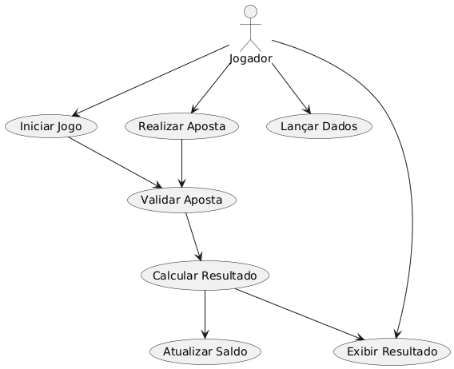

# jogo-de-dados-poo
# 🎲 Jogo de Dados

## 👩‍💻 Desenvolvido por
Maria Yasmin Morais - IF24

---

## 📋 Levantamento de Requisitos

### Requisitos Funcionais
- **RF01** Iniciar jogo: permite que o jogador comece uma nova partida de apostas com dois dados.  
- **RF02** Realizar aposta: o jogador escolhe um número entre 2 e 12 e define o valor a apostar.  
- **RF03** Validar aposta: o sistema verifica se o valor é válido e se o jogador tem saldo suficiente.  
- **RF04** Lançar os dados: o sistema gera valores aleatórios entre 1 e 6 para cada dado.  
- **RF05** Limite de jogadas: o jogador pode lançar no máximo duas vezes por aposta.  
- **RF06** Calcular resultado: soma os dois valores e exibe o total.  
- **RF07** Verificar acerto: o sistema compara o número apostado com o resultado.  
- **RF08** Atualizar saldo: credita ou debita conforme vitória ou derrota.  
- **RF09** Exibir resultado da rodada.  
- **RF10** Nova aposta ou encerrar jogo.  

### Requisitos Não Funcionais
- **RNF01** Usabilidade  
- **RNF02** Aleatoriedade realista  
- **RNF03** Desempenho  
- **RNF04** Segurança  
- **RNF05** Confiabilidade  
- **RNF06** Portabilidade  
- **RNF07** Acessibilidade  

---

## 🧩 Diagrama de Classes


---
# 🗃️ Banco de Dados - Jogo de Dados

## 💾 Estrutura do Banco (MySQL)
O banco de dados contém as tabelas principais do jogo, responsáveis por armazenar informações dos jogadores, apostas e resultados.

📄 [Download do Script SQL](./banco_jogo_dados.sql)

### 🔹 Exemplo de tabela
```sql
CREATE TABLE jogador (
  id BIGINT AUTO_INCREMENT PRIMARY KEY,
  nome VARCHAR(100),
  saldo DECIMAL(10,2)
);

## 🎭 Diagrama de Casos de Uso


---
## 🔗 Repositório no GitHub
[Link para o repositório](https://github.com/yasminveras/jogo-de-dados-poo.git)
